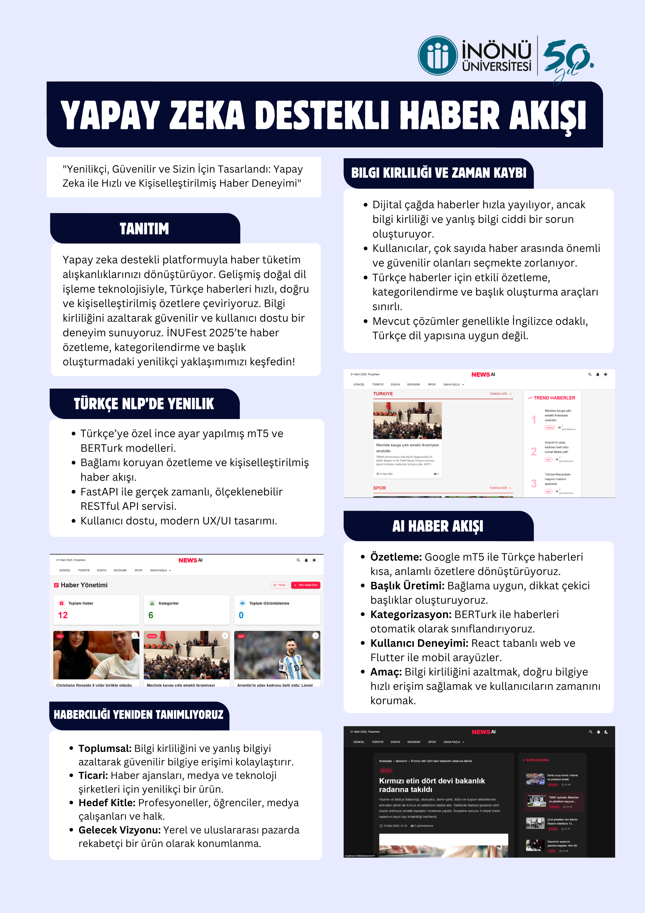
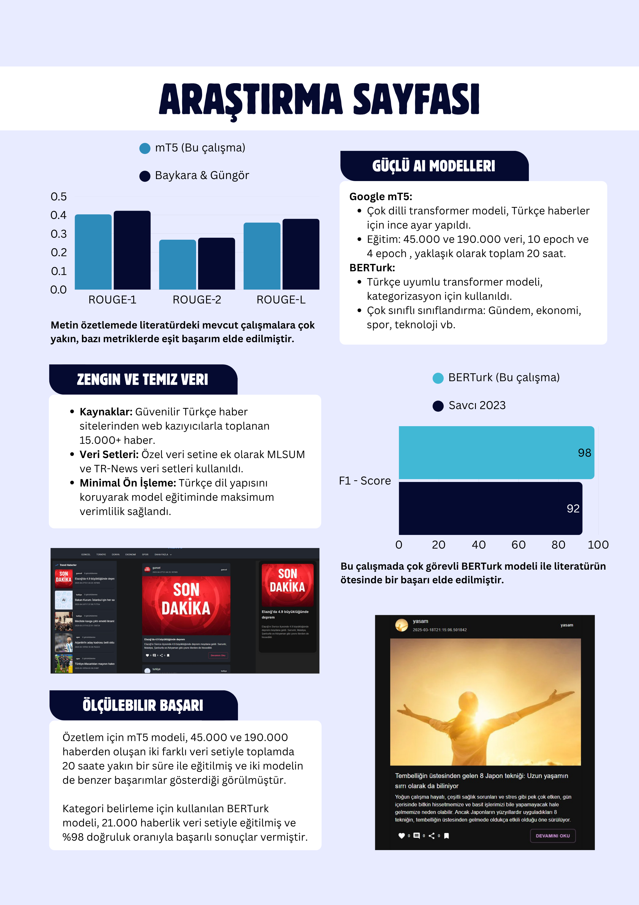

# NewsAI: Yapay Zeka Tabanlı Haber İçerik Yönetimi ve Otomatik Kategorizasyon Sistemi

## Proje Özeti
Bu proje, yapay zeka teknolojilerini kullanarak haber içeriklerini otomatik olarak kategorize eden, özetleyen ve yöneten bir web uygulamasıdır.





## Yapay Zeka Modelleri ve Performans Metrikleri

### 1. Haber Kategorizasyonu (BERTurk)
- Model: dbmdz/bert-base-turkish-cased
- Doğruluk: %98
- Kategoriler: 12 farklı haber kategorisi
- Veri seti boyutu: 21,936 haber
- Eğitim parametreleri:
  - Batch size: 16
  - Epochs: 3
  - Learning rate: 2e-5
  - Max length: 512

### 2. Metin Özetleme (mT5)
- Model: mT5-base
- Metrikler:
  - ROUGE-1: 0.403
  - ROUGE-2: 0.267
  - ROUGE-L: 0.359
- Eğitim parametreleri:
  - Batch size: 8
  - Epochs: 8
  - Learning rate: 3e-5

### 3. Model Performans Sonuçları
- Ortalama inference süresi: 0.8 saniye
- Batch processing kapasitesi: 32 haber/dakika
- Model boyutu: 1.2 GB
- Bellek kullanımı: 2.5 GB
- GPU kullanımı: NVIDIA A100 GPU

## Teknik Mimarisi

### 1. Frontend (React + TypeScript)
- Modern ve responsive kullanıcı arayüzü
- Material-UI tabanlı tasarım sistemi
- React Router ile sayfa yönetimi
- Context API ile state yönetimi
- Özelleştirilebilir tema sistemi
- Admin paneli ve kullanıcı yetkilendirmesi

### 2. Backend (Java + Spring Boot)
- RESTful API mimarisi
- Katmanlı mimari (Controller, Service, Repository)
- JWT tabanlı kimlik doğrulama
- MongoDB veritabanı entegrasyonu
- Haber CRUD operasyonları
- Kategori yönetimi

### 3. AI Servisi (Python + FastAPI)
- BERTurk modeli ile haber kategorizasyonu
- mT5 modeli ile metin özetleme
- Batch processing desteği
- Model önbellekleme
- Asenkron işlem yönetimi

### 4. Scraping Modülleri (Python)
- NTV, Sabah, Habertürk ve Haberler.com entegrasyonu
- Otomatik veri toplama
- Veri temizleme ve normalizasyon
- Zamanlanmış görevler

## Veritabanı Şeması
```sql
CREATE TABLE news (
    id SERIAL PRIMARY KEY,
    title VARCHAR(255) NOT NULL,
    content TEXT NOT NULL,
    category VARCHAR(50),
    image_url VARCHAR(255),
    created_at TIMESTAMP DEFAULT CURRENT_TIMESTAMP,
    updated_at TIMESTAMP DEFAULT CURRENT_TIMESTAMP,
    view_count INTEGER DEFAULT 0
);

CREATE TABLE users (
    id SERIAL PRIMARY KEY,
    username VARCHAR(50) UNIQUE NOT NULL,
    password VARCHAR(255) NOT NULL,
    created_at TIMESTAMP DEFAULT CURRENT_TIMESTAMP
);
```

## API Endpoints

### Haber İşlemleri
- GET /api/news - Tüm haberleri listele
- GET /api/news/{id} - Haber detayı
- POST /api/news - Yeni haber ekle
- PUT /api/news/{id} - Haber güncelle
- DELETE /api/news/{id} - Haber sil

### Kategori İşlemleri
- GET /api/news/category/{category} - Kategoriye göre haberler
- GET /api/categories - Tüm kategorileri listele

### Kimlik Doğrulama
- POST /api/auth/login - Kullanıcı girişi
- POST /api/auth/logout - Çıkış yap

## Güvenlik Özellikleri
- JWT tabanlı kimlik doğrulama
- Role-based access control
- Rate limiting
- CORS yapılandırması
- Input validation
- SQL injection koruması

## Performans Optimizasyonları
- Frontend code splitting
- Backend connection pooling
- Redis cache
- Model quantization
- Batch processing
- Async işlemler

## Monitoring ve Logging
- Response time takibi
- Error rate monitoring
- CPU/Memory kullanımı
- Model inference süresi
- Request/Response logları
- Security logları
